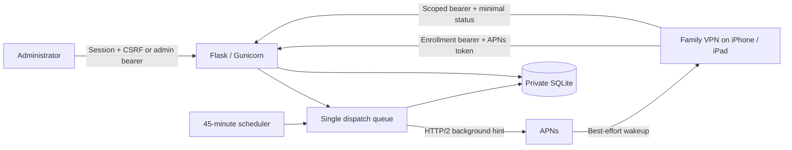

> Version 0.3.0: authenticated POST status and command acknowledgements may be public; registration is restricted to 192.168.10.0/24; remaining REST routes stay VPN-only. See the repository `docs/REMOTE_COMMANDS.md` for complete setup instructions.

# Architecture

## Responsibilities

`app.py` owns configuration validation, storage, APNs authentication/delivery, dispatch, scheduling and HTTP routes. `wsgi.py` is the production entry point. Templates and static files render the dashboard. `setup_local.py` creates private local secrets without printing them.

The native sibling MyVPN application owns VPN configuration and recovery. Enrollment authorizes signed refresh, suspend and enable commands. The native app validates each request and changes suspension through its serialized preference transaction; trusted Wi-Fi rules remain in effect. Status reporting remains best effort and does not block local recovery on network failure.

## Credentials

ADMIN_BEARER authorizes administrative API requests and dashboard sign-in. REGISTRATION_BEARER authorizes enrollment. Each enrollment returns a new per-installation status credential; only its SHA-256 hash is retained server-side. Re-registration revokes the old report credential while preserving the installation's last report. SESSION_SECRET signs browser session cookies. The APNs provider key is used only when sending a configured push; provider JWTs are cached for up to 50 minutes.

## Concurrency and persistence

One Gunicorn worker with four threads serves requests. One dispatch thread serializes sends; a lock rejects overlapping requests. The optional scheduler requests checks after each configured interval. All scheduling is process-local, so multiple workers/replicas would cause duplicate dispatches.

SQLite connections are short-lived and transactions do not span HTTP calls to Apple. Delivery results are written only if the installation still has the same token, preventing an old failure from invalidating a newly registered token. Invalid tokens are cleared rather than deleting the installation. Event history retains the newest 200 entries, while the dashboard displays the newest 30.

Signed command requests are durable in SQLite; restarts retain their device scope, expiry, sequence, verifier snapshot and delivery/acknowledgement state. Retries are bounded to once per 15 minutes and supersession is separate for policy, refresh and administrator commands. Native receipts persist in Keychain until acknowledged. Status reports themselves have no offline queue and are independent of command acknowledgements; an APNs acceptance alone does not prove execution. Legacy wake-only checks remain best effort.

## Home Assistant packaging

Canonical runtime files live in `family_vpn/`. Root `app.py`/`wsgi.py` are standalone compatibility entry points. `addon.py` reads Supervisor options and manages non-secret overrides; `ingress.py` restricts each socket, validates the gateway peer and builds Ingress-prefixed links/cookies. Both listeners share one Gunicorn worker, one scheduler and one database. APNs configuration changes serialize with dispatch; bearer credentials are edited in the Home Assistant options UI.
